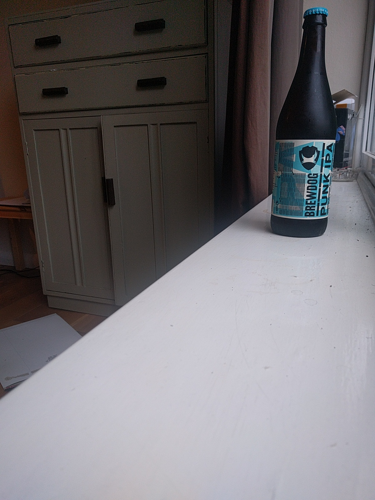
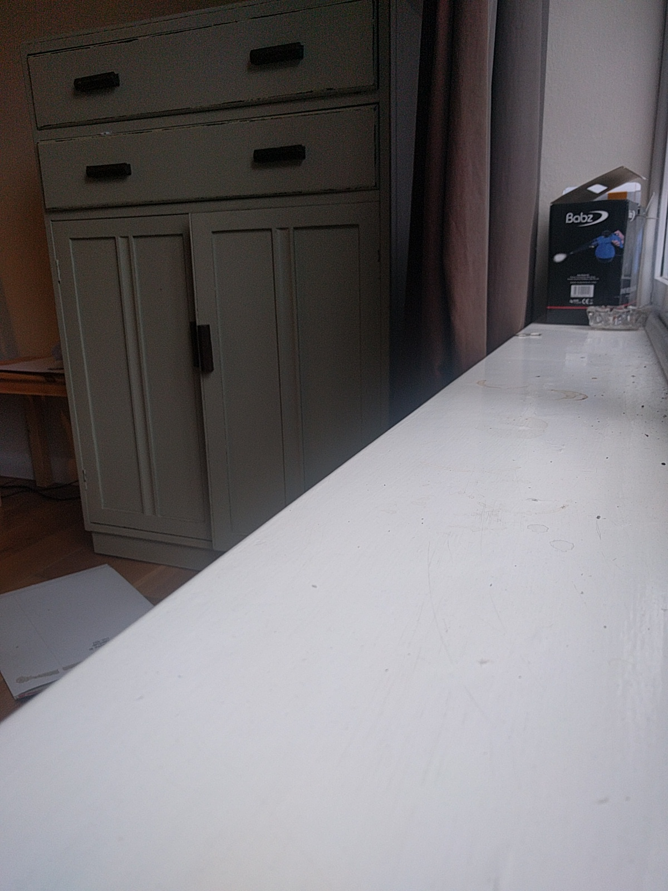
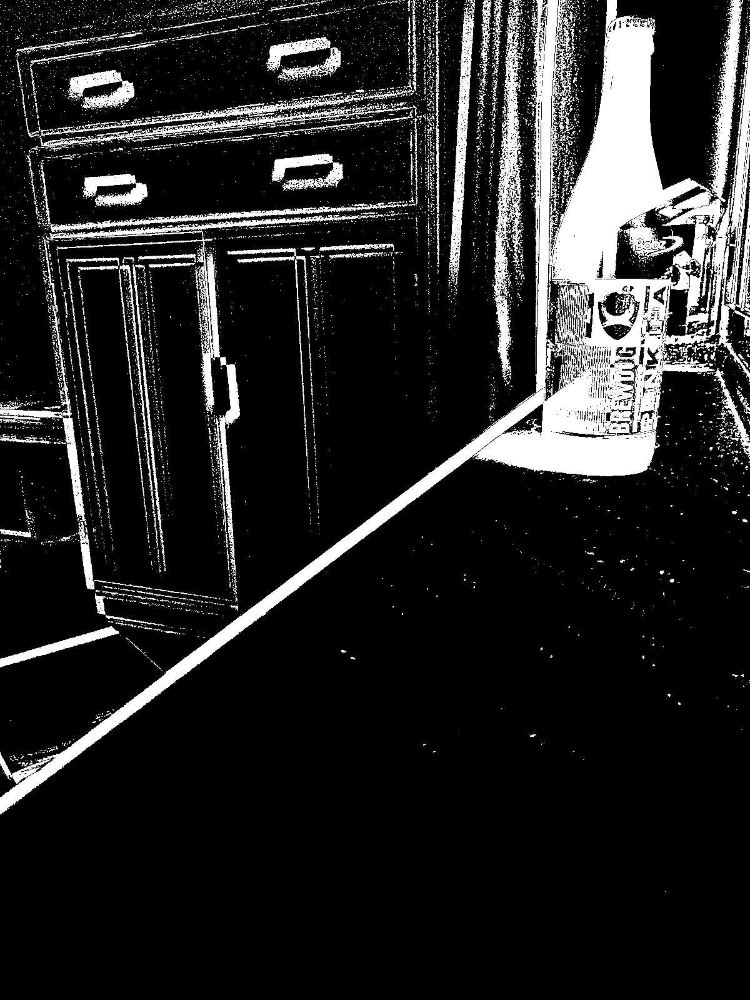

# blend-mode-difference

Given two Buffers of ImageData (one-dimensional array containing the data in the RGBA order),
it will return an ImageData Buffer containing the the blend mode difference of the two images:

```
    const beerData = fs.readFileSync('./test/beer.jpg');
    const noBeerData = fs.readFileSync('./test/no_beer.jpg');
    const rawBeerData = jpeg.decode(beerData);
    const rawNoBeerData = jpeg.decode(noBeerData);

    const blendedImageData = blendModeDifference(rawBeerData.data, rawNoBeerData.data);
    const blendedJpg = jpeg.encode({width: 1200, height: 1600, data: blendedImageData}, 50);
    fs.writeFile('./test/blended.jpg', blendedJpg.data, function() {
      console.log('done');
    })
```

### beer.jpg




### no_beer.jpg




### blended.jpg




